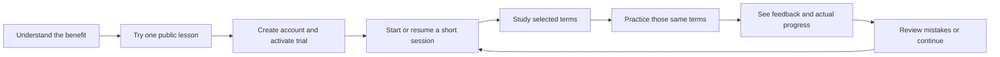

# Website design and experience proposal

Review date: 10 September 2026. Implementation update: changes across all four stages are implemented and the previously pending local verification is complete. See [final verification results](verification/results.md), [stage-one results](stage-one/results.md), [stage-two results](stage-two/results.md), and [final-stage implementation history](final-stage/results.md). The findings below document the original review; verification scope and limits are recorded in the final report.

## Recommendation

The site has a recognizable purple/yellow identity, a distinctive hero image stack, working sample-lesson interactions, and useful learning tools. The next upgrade should make the experience more coherent: show the product sooner, make one next learning action prominent, and improve reading comfort across screens.

Preserve the current product-first branding (Legal English 5, by MPC LAW STUDIO), explicitly documented as CR-07 in `components/brand-mark.tsx`. Preserve approved terminology and editorial content. These proposals concern presentation and interaction; commercial copy and billing behavior require consistency with the current approved rules.

## What was actually checked

- Built the current workspace source in an isolated local copy; production build passed.
- Browser sweep: 186 combinations across English/Spanish and widths 1440, 768, and 390 pixels. This comprises 120 public/unpublished-content layouts and 66 populated learner layouts, not 186 distinct pages.
- Public routes: home, pricing, about, how-it-works, login, signup, terms, sample-terms, help. Actual redirect destinations were recorded.
- Learner routes: dashboard, terms, categories, CON-001 lesson and its quiz, quizzes, saved library, progress, account, settings, billing.
- Fresh seed content is unpublished. To inspect populated pages, all 30 seed terms were marked published only in the disposable copy. Existing workspace account and content data were not changed. Empty-state observations describe that fixture, not the production catalogue.
- Targeted interactions: mobile-menu keyboard traversal, sample tab selection, wrong/correct sample answers and retry, empty search recovery, bookmark persistence, list view, dashboard-to-quiz navigation, quiz feedback, and next question.
- No page exceptions, broken visible images, or document-level horizontal overflow were detected in the 186-layout sweep. This does not rule out local word breaking, truncation, inaccessible focus, or confusing flows; several were observed below.
- The first radio-button automation attempt targeted visually hidden inputs. The corrected check clicked the visible answer labels and passed; the initial automation timeouts are not application defects.
- This is a local review, not verification of the deployed website, real payments, email delivery, every lesson, all account actions, screen-reader behavior, or real-user performance. Most layout captures used reduced motion for stable comparison; animation recommendations below also draw on source inspection.

## Priority 1 — repair the journey and obvious presentation issues

### 1. Keep a daily session consistent from study to quiz

**Observed:** The dashboard showed five suggested terms spanning Contracts and Corporate Law. “Quiz me on these” opened `/quizzes?category=Contracts`, displaying “Question 1 of 10.” This was reproduced in the browser. `components/learner-dashboard.tsx` selects the category from the first suggested term rather than passing the displayed term set.

**Proposed:** Carry the exact selected terms into the quiz, preserving the session across study, practice, and results. Show “Term 1 of 5” and “Question 1 of 5” for that session. If category-wide practice is intended instead, explicitly label the action “Practice Contracts.”

**Acceptance:** Every term offered by “Quiz me on these” matches the displayed session, with a clear finish and next-session action. Resuming a session retains its scope.

### 2. Bring the public sample into the first part of the visit

**Observed:** Home has eleven main sections. The sample is fifth, after the problem, solution, and eight component cards. At 390px its section starts approximately 2,947px down; the full English homepage measures approximately 10,335px. “Terms Library,” `/sample-terms`, and direct `/how-it-works` resolve to login when signed out. The header's “How It Works” correctly links to the homepage sample anchor, so the two how-it-works entry points behave differently.

**Proposed:** Add a secondary “Try a sample lesson” hero action and move the existing interactive preview immediately after a short value/trust strip. Keep protected catalogue access explicit. Make public how-it-works entry points lead to the public explanation or sample.

**Acceptance:** A signed-out visitor can reach and complete the existing sample in one deliberate action without an unexpected login screen. No access to protected course content needs to change.

[Current hero and opening sections](en-public-_-1440-part0.png) · [Current product preview](en-public-_-1440-part1.png)

### 3. Fix mobile word breaks and navigation labels

**Observed:** At 390px the three library category tiles stay side by side, splitting names within words: “Cor por ate Law,” “Contra cts,” and “Employ ment Law.” Bottom navigation truncates “Terms Li…” and “Categori…”. These issues exist despite the absence of page-level horizontal overflow.

**Proposed:** Use full-width category rows or a compact category selector on phones. Use short, explicit bottom-navigation labels such as Home, Terms, Areas, Quiz, Progress, with natural Spanish equivalents. Give filter states a balanced two-column layout rather than leaving one tab on a separate row. Keep full accessible names.

**Acceptance:** Labels remain readable at 320/390/768px in both languages and at increased text size. No forced midword breaks in category names or ellipses in essential navigation.

[Mobile terms library](en-learner-_terms-390-top.png) · [Spanish mobile library](es-learner-_terms-390-top.png)

### 4. Replace the misleading understanding meter

**Observed:** The CON-001 lesson renders “Understanding” with its last letter on a separate line. Source maps New to 10%, Learning to 60%, and Mastered to 100%; the percentage is assigned from state rather than a measured understanding score.

**Proposed:** Present New → Learning → Mastered as a labeled state indicator. Reserve percentages for defined quantities such as correct answers or mastered terms out of published terms. Move supporting labels outside small rings.

**Acceptance:** No broken labels; every displayed percentage has a clear denominator and meaningful explanation. Avoid changing the underlying mastery rules as part of a visual revision.

[Current lesson and progress ring](en-learner-_terms_CON-001-1440.png)

### 5. Contain focus while the public mobile menu is open

**Observed:** Keyboard Tab moved through navigation and then onto the covered hero CTA and carousel controls while the menu remained open. Escape closes the menu, but the background is still keyboard reachable.

**Proposed:** Match the learner drawer's focus behavior: contain focus within the open navigation, make background content inert, and restore focus to the opener on close.

**Acceptance:** Tab and Shift+Tab remain in the active menu; Escape closes it and returns focus. Closed navigation stays out of keyboard order.

## Priority 2 — improve visual hierarchy and reading comfort

### 6. Make the homepage tell a shorter, clearer story

Recommended order:

1. **Hero:** who it is for, practical benefit, trial action, sample action, and the existing 3D photography.
2. **Compact credibility strip:** named editorial ownership and the three practice areas, using verified claims only.
3. **Interactive lesson:** see a definition, explore context, answer one question, get feedback.
4. **Three practice areas:** clear category cards and what the user can study.
5. **Learning method:** one concise sequence — learn, practice, track, continue. Consolidate repetitive problem/solution/component copy here.
6. **Editorial authority:** a concise introduction to Pilar Cruz and the review process before the payment decision.
7. **Pricing, focused FAQ, final action:** clear charge timing and renewal conditions.

A provisional design target is roughly 25–30% less scrolling on mobile, achieved through consolidation rather than smaller text or hidden disclosures. Validate against the actual revised content.

### 7. Widen library cards and simplify their hierarchy

**Observed:** The 1440px desktop library fits five cards across the learner content area. Term names appear small and light, while definitions wrap into many short lines. The category panels above consume substantial height.

**Proposed:** Use three comfortable columns on typical desktop widths, two on tablets, one on phones. Make the term name the strongest element, followed by a readable definition excerpt and a stable status/save row. Keep list view for scanning and preserve URL-based filters. Use a compact category row when browsing all terms.

[Desktop terms library](en-learner-_terms-1440.png)

### 8. Give dashboard and quiz a single dominant task

**Observed:** A completed getting-started checklist can remain above the daily session until manually hidden. The quiz screen puts four statistics cards above the active question, with multiple mastery and achievement blocks alongside it. Default mixed practice can begin at “Question 1 of 30.”

**Proposed:** Collapse completed onboarding into a small summary, foreground “Continue your session,” and put secondary metrics below the task. Place the active quiz question first, with a compact progress header and a defined short session. Present results as score, explanation/review, and next step; the existing wrong-answer review behavior should be retained.

[Dashboard](en-learner-_dashboard-1440.png) · [Quiz screen](en-learner-_quizzes-1440-top.png)

### 9. Make the lesson easier to follow on mobile

**Observed:** The mobile lesson stacks a photo, breadcrumb capsule, term/audio row, status row, and separately padded lesson cards. The definition starts well below the top of the page. Separate quiz and next-term entry points create several competing actions.

**Proposed:** Compact the decorative header, group the term, pronunciation, and status together, and use the approved lesson sequence with consistent section spacing. Add a clear mobile lesson action area that respects the existing bottom-navigation space. Reveal explanatory material through clear sections without inventing or rewriting approved terminology.

[Mobile lesson](en-learner-_terms_CON-001-390-top.png)

### 10. Simplify signup and pricing presentation

**Observed:** The signup checkbox repeats the policy names in a sentence and again in adjacent links. A generic “By signing in…” footer appears on the create-account screen. Trial/renewal explanations appear more than once within pricing cards. Annual billing requires activation of the trial first, which adds a step to the user's decision.

**Proposed:** Present one clear policy-consent sentence with linked policy names. Use mode-specific sign-in/signup language. Arrange signup as a visible sequence — create account, activate trial, begin learning — matching actual behavior. Give pricing a concise comparison and consistent disclosure grouping while retaining all required card, renewal, charge, and cancellation information. Explain the annual selection timing at the decision point.

[Mobile signup](en-public-_signup-390-part0.png) · [Pricing](en-public-_pricing-1440-part0.png)

### 11. Make supporting pages serve their specific purpose

- **About:** Lead with the named editor and practical learner benefit. Put detailed content-database explanations under “How we review content.” A real, approved editor portrait could strengthen credibility; do not imply a stock subject is Pilar. Current page uses office imagery.
- **Progress:** Lead with “What to study next,” then real progress and a concise weekly view. Keep activity and achievements secondary. Collapse empty charts or pair them with an actionable starting point.
- **Saved library:** Keep saved terms immediately accessible, with a meaningful empty-state action and the same card/filter system as Terms.
- **Account/settings:** Prioritize profile, preferences, security, and subscription tasks. Reduce unrelated photography/statistics so forms are easier to find. Use comfortably sized controls and labels.
- **Help/billing:** Preserve direct support and subscription actions, including current state, renewal timing, and next action. Separate explanations from the main action.
- **No-content state:** The local unpublished fixture says “AudioUS required” and “Approved is not Published.” Replace learner-facing implementation language with availability information and a useful support/sample action. Keep publication diagnostics in the owner interface.

[About](en-public-_about-1440-part0.png) · [Account](en-learner-_account-1440-top.png) · [Unpublished fixture dashboard](en-learner-_dashboard-1440-part0.png)

## Priority 3 — unify the visual system and motion

- **Color:** Keep approved purple/yellow branding. Use yellow selectively for emphasis, purple for primary actions, neutral backgrounds for reading, and semantic colors consistently.
- **Typography:** Keep serif display headings for editorial character. Use stronger, comfortably sized term titles and functional labels; several current controls measure around 11px. Suggested normal reading size: 15–16px, controls 13–14px, compact metadata 12–13px, subject to visual testing.
- **Spacing:** Consolidate an 8-point spacing scale with a few shared card, input, and button treatments. Establish consistent content widths and section rhythm.
- **Backgrounds:** Reserve dotted textures and image overlays for selected marketing moments. Quieter learner surfaces will give definitions and controls greater emphasis.
- **Images:** Set focal points per image and screen size. Use imagery to explain practice areas and establish context; avoid large decorative blocks between a learner and their next action.
- **Motion:** Keep the existing hero zoom/depth effect as the main animated feature. Use brief fades and small translations for secondary transitions, and concise feedback for saved/completed actions. Coordinate slideshow and camera pause behavior: current hover/focus stops slide changes but image motion continues. Pause offscreen animations and honor reduced motion. More simultaneous animation would weaken reading focus.
- **Implementation:** The stylesheet is now over 26,000 lines with many successive overrides. Consolidate shared components and scoped rules in stages, supported by visual comparisons, rather than adding another broad override layer.

## Proposed end-to-end learning flow

## Implementation order for approval

1. **Flow and usability corrections:** session/quiz scope, mobile category word breaks, progress-state display, public-menu keyboard behavior, and sample discoverability.
2. **Shared learning presentation:** card widths, typography, dashboard priority, lesson actions, quiz focus, and bilingual mobile navigation.
3. **Marketing flow:** reorganize existing homepage content, improve About/trust placement, and simplify signup/pricing presentation while preserving approved rules.
4. **Final polish:** coordinated motion, focal-point review, loading/empty/error consistency, and gradual CSS consolidation.

Each stage should be reviewed at 1440/1024/768/390/320px in both languages, with empty, populated, loading, error, and expired-access states where applicable. Include keyboard traversal, reduced-motion checks, 200% text sizing, and visual evidence. Use existing analytics to establish baselines for sample engagement and session completion before making claims about conversion improvements.

## Evidence

- `layout-checks.json`: the 186-layout inventory, redirects, headings, sizes, and automated findings.
- `interactions.json`: initial interaction results, including the mobile focus escape and the radio-selector automation limitation.
- `feedback.json`: corrected visible-answer interaction results and the confirmed five-term/ten-question mismatch.
- Screenshots linked above capture the current source and disposable fixtures, not proposed designs.

Changes across the four implementation stages are in the workspace. Final verification passed 150 responsive layouts, 36 enlarged-text layouts, auth redirects, state/retry checks, keyboard/motion checks, and the selected-session journey. The eight previously flagged overflow cases now pass. See the verification report for evidence and exact scope. Full stylesheet consolidation, real-user analytics, screen-reader certification, and live-service verification are not claimed complete.
